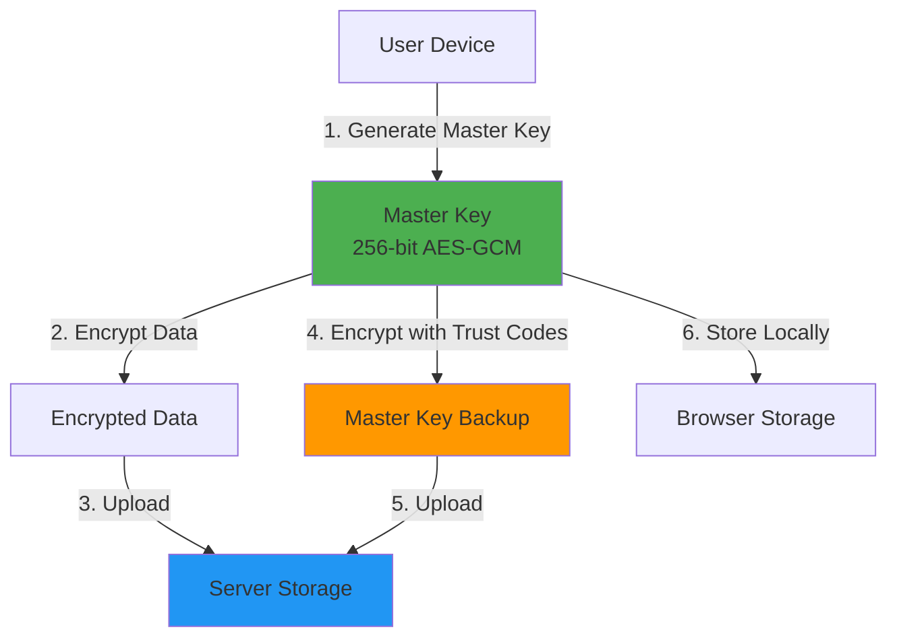
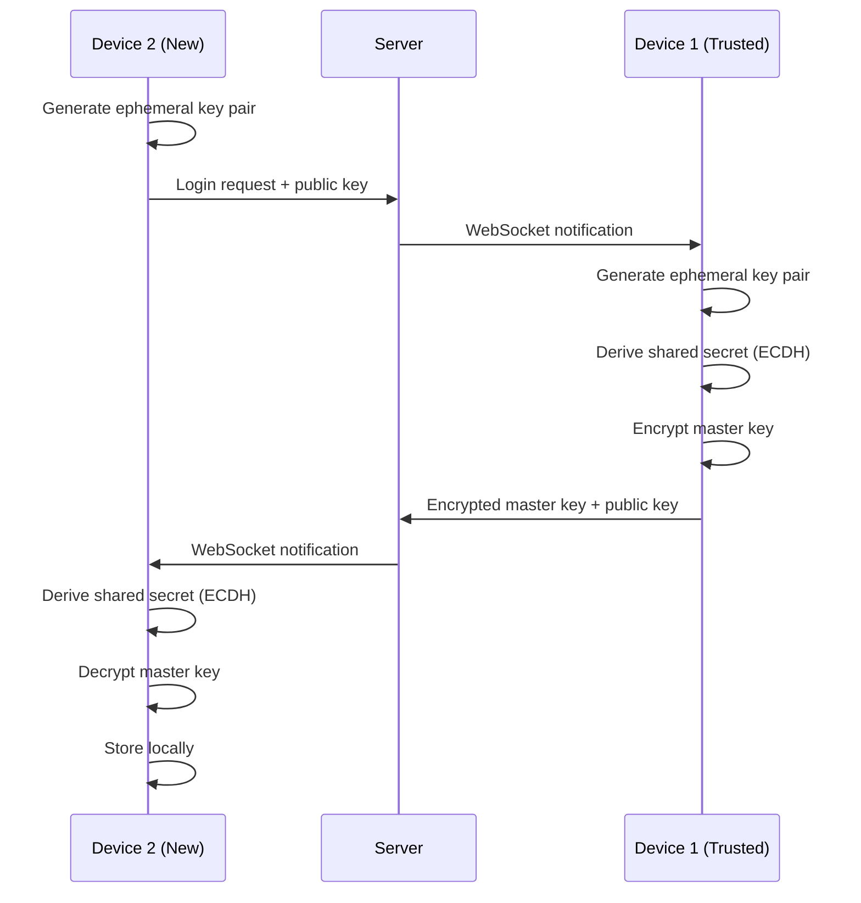

Ave implements **end-to-end encryption (E2EE)** to ensure that only you can read your data. The server stores encrypted blobs that it cannot decrypt, providing a zero-knowledge architecture.

## Encryption Architecture



<Note>
The master key **never leaves your device in plaintext**. All encryption and decryption happens client-side in your browser.
</Note>

## Master Key Generation

During registration, your browser generates a 256-bit AES-GCM master key:

```typescript
// Generate master key using Web Crypto API
export async function generateMasterKey(): Promise<CryptoKey> {
  return await crypto.subtle.generateKey(
    { name: "AES-GCM", length: 256 },
    true, // extractable (for backup)
    ["encrypt", "decrypt"]
  );
}
```

See [ave-web/src/lib/crypto.ts:19](https://github.com/your-org/ave/blob/main/ave-web/src/lib/crypto.ts#L19).

<Steps>
  <Step title="Key Generation">
    Master key is created using `crypto.subtle.generateKey()` with cryptographically secure randomness.
  </Step>

  <Step title="Local Storage">
    Master key is stored in browser localStorage (base64 encoded) for reuse.
    
    ```typescript
    export async function storeMasterKey(masterKey: CryptoKey): Promise<void> {
      const keyData = await exportMasterKey(masterKey);
      const encoded = btoa(String.fromCharCode(...new Uint8Array(keyData)));
      localStorage.setItem("ave_master_key", encoded);
    }
    ```
  </Step>

  <Step title="Backup Creation">
    Master key is encrypted with trust codes and uploaded to server.
  </Step>
</Steps>

## Data Encryption

All sensitive data is encrypted before sending to the server:

```typescript
// Encrypt data with AES-GCM
export async function encrypt(
  data: string | ArrayBuffer,
  key: CryptoKey
): Promise<string> {
  const encoder = new TextEncoder();
  const dataBuffer = typeof data === "string" 
    ? encoder.encode(data) 
    : data;
  
  // Generate random 12-byte IV (nonce)
  const iv = crypto.getRandomValues(new Uint8Array(12));
  
  // Encrypt data
  const encrypted = await crypto.subtle.encrypt(
    { name: "AES-GCM", iv },
    key,
    dataBuffer
  );
  
  // Combine IV + ciphertext and encode as base64
  const combined = new Uint8Array(iv.length + encrypted.byteLength);
  combined.set(iv, 0);
  combined.set(new Uint8Array(encrypted), iv.length);
  
  return btoa(String.fromCharCode(...combined));
}
```

See [ave-web/src/lib/crypto.ts:85](https://github.com/your-org/ave/blob/main/ave-web/src/lib/crypto.ts#L85).

### Encryption Format

Encrypted data is stored as base64 in this format:

```
[12-byte IV][variable-length ciphertext][16-byte auth tag]
```

- **IV (Initialization Vector)**: Random 12-byte nonce, unique per encryption
- **Ciphertext**: Encrypted data
- **Auth Tag**: 16-byte GCM authentication tag (prevents tampering)

<Warning>
**Never reuse IVs!** Each encryption operation generates a fresh random IV. Reusing IVs with AES-GCM is catastrophic for security.
</Warning>

## Data Decryption

Decryption reverses the process:

```typescript
export async function decrypt(
  encryptedData: string,
  key: CryptoKey
): Promise<ArrayBuffer> {
  // Decode base64
  const combined = Uint8Array.from(
    atob(encryptedData), 
    (c) => c.charCodeAt(0)
  );
  
  // Extract IV and ciphertext
  const iv = combined.slice(0, 12);
  const ciphertext = combined.slice(12);
  
  // Decrypt
  return await crypto.subtle.decrypt(
    { name: "AES-GCM", iv },
    key,
    ciphertext
  );
}
```

See [ave-web/src/lib/crypto.ts:112](https://github.com/your-org/ave/blob/main/ave-web/src/lib/crypto.ts#L112).

## Master Key Backup

To enable account recovery, the master key is encrypted with trust codes and backed up to the server:

```typescript
export async function createMasterKeyBackup(
  masterKey: CryptoKey,
  trustCodes: string[]
): Promise<string> {
  // Export master key to raw bytes
  const masterKeyData = await exportMasterKey(masterKey);
  
  // Encrypt with each trust code
  const backups: string[] = [];
  
  for (const code of trustCodes) {
    // Derive encryption key from trust code using PBKDF2
    const derivedKey = await deriveKeyFromTrustCode(code);
    
    // Encrypt master key
    const encrypted = await encrypt(masterKeyData, derivedKey);
    backups.push(encrypted);
  }
  
  // Store as JSON
  return JSON.stringify({
    version: 1,
    backups
  });
}
```

See [ave-web/src/lib/crypto.ts:144](https://github.com/your-org/ave/blob/main/ave-web/src/lib/crypto.ts#L144).

### Trust Code Key Derivation

Trust codes are converted to encryption keys using PBKDF2:

```typescript
export async function deriveKeyFromTrustCode(code: string): Promise<CryptoKey> {
  // Normalize: uppercase, strip non-alphanumeric
  const normalized = code.toUpperCase().replace(/[^A-Z0-9]/g, "");
  const encoder = new TextEncoder();
  
  // Import as key material
  const keyMaterial = await crypto.subtle.importKey(
    "raw",
    encoder.encode(normalized),
    "PBKDF2",
    false,
    ["deriveKey"]
  );
  
  // Derive AES key using PBKDF2
  const salt = encoder.encode("ave-trust-code-salt-v1");
  
  return await crypto.subtle.deriveKey(
    {
      name: "PBKDF2",
      salt,
      iterations: 100000, // 100k iterations
      hash: "SHA-256"
    },
    keyMaterial,
    { name: "AES-GCM", length: 256 },
    false,
    ["encrypt", "decrypt"]
  );
}
```

See [ave-web/src/lib/crypto.ts:51](https://github.com/your-org/ave/blob/main/ave-web/src/lib/crypto.ts#L51).

<Note>
100,000 PBKDF2 iterations provide reasonable protection against brute-force attacks while remaining fast enough for user experience. In production, consider increasing to 600,000+ iterations.
</Note>

## Recovery Flow

When recovering your account with a trust code:

<Steps>
  <Step title="Enter Trust Code">
    User provides one of their saved trust codes.
  </Step>

  <Step title="Fetch Encrypted Backup">
    Client retrieves `encryptedMasterKeyBackup` from server.
    
    ```typescript
    POST /api/login/trust-code
    {
      "handle": "alice",
      "code": "ABCDE-12345-FGHIJ-67890-KLMNO",
      "device": { ... }
    }
    
    Response:
    {
      "sessionToken": "...",
      "encryptedMasterKeyBackup": "{\"version\":1,\"backups\":[...]}" 
    }
    ```
  </Step>

  <Step title="Derive Decryption Key">
    Trust code is normalized and converted to encryption key via PBKDF2.
  </Step>

  <Step title="Decrypt Master Key">
    Each backup in the JSON is tried until one successfully decrypts.
    
    ```typescript
    export async function recoverMasterKeyFromBackup(
      backup: string,
      trustCode: string
    ): Promise<CryptoKey | null> {
      const data = JSON.parse(backup);
      const derivedKey = await deriveKeyFromTrustCode(trustCode);
      
      // Try each backup
      for (const encryptedBackup of data.backups) {
        try {
          const masterKeyData = await decrypt(encryptedBackup, derivedKey);
          return await importMasterKey(masterKeyData);
        } catch {
          continue; // Wrong trust code, try next
        }
      }
      
      return null;
    }
    ```
  </Step>

  <Step title="Store Master Key">
    Recovered master key is stored in localStorage for future use.
  </Step>
</Steps>

See [ave-web/src/lib/crypto.ts:171](https://github.com/your-org/ave/blob/main/ave-web/src/lib/crypto.ts#L171).

## Multi-Device Key Transfer

When logging in on a new device via device approval, the master key is transferred using ephemeral ECDH (Elliptic Curve Diffie-Hellman) key exchange:



### ECDH Key Exchange

<Steps>
  <Step title="Device 2: Generate Ephemeral Keypair">
    The requesting device generates a one-time ECDH P-256 keypair:
    
    ```typescript
    const keyPair = await crypto.subtle.generateKey(
      { name: "ECDH", namedCurve: "P-256" },
      true,
      ["deriveKey"]
    );
    
    // Export public key to send to server
    const publicKeyData = await crypto.subtle.exportKey(
      "spki", 
      keyPair.publicKey
    );
    const publicKey = btoa(String.fromCharCode(...new Uint8Array(publicKeyData)));
    ```
  </Step>

  <Step title="Device 1: Encrypt Master Key">
    The approving device:
    
    1. Generates its own ephemeral keypair
    2. Imports Device 2's public key
    3. Derives shared secret via ECDH
    4. Encrypts master key with shared secret
    
    ```typescript
    // Import requester's public key
    const recipientPublicKey = await importPublicKey(requesterPublicKeyB64);
    
    // Derive shared secret
    const sharedKey = await crypto.subtle.deriveKey(
      { name: "ECDH", public: recipientPublicKey },
      senderPrivateKey,
      { name: "AES-GCM", length: 256 },
      false,
      ["encrypt", "decrypt"]
    );
    
    // Encrypt master key
    const encrypted = await encrypt(masterKeyData, sharedKey);
    ```
  </Step>

  <Step title="Device 2: Decrypt Master Key">
    The requesting device:
    
    1. Imports Device 1's public key
    2. Derives same shared secret using its private key
    3. Decrypts master key
    
    ```typescript
    const senderPublicKey = await importPublicKey(approverPublicKeyB64);
    const sharedKey = await deriveSharedKey(recipientPrivateKey, senderPublicKey);
    const masterKeyData = await decrypt(encryptedMasterKey, sharedKey);
    const masterKey = await importMasterKey(masterKeyData);
    ```
  </Step>
</Steps>

See [ave-web/src/lib/crypto.ts:256](https://github.com/your-org/ave/blob/main/ave-web/src/lib/crypto.ts#L256) for implementation.

<Note>
Ephemeral keys are never stored - they're generated on-demand for each login request and discarded after use. This provides **forward secrecy**: even if a key is compromised, past transfers remain secure.
</Note>

## PRF-Based Encryption

Passkeys supporting the **PRF (Pseudo-Random Function)** extension can derive deterministic secrets. Ave uses this to store a master key backup that only unlocks with the specific passkey:

```typescript
// During passkey registration
const credential = await navigator.credentials.create({
  publicKey: {
    ...options,
    extensions: {
      prf: { eval: { first: salt } } // Request PRF output
    }
  }
});

const prfOutput = credential.getClientExtensionResults().prf?.results.first;

if (prfOutput) {
  // Encrypt master key with PRF output
  const prfEncrypted = await encryptMasterKeyWithPrf(masterKey, prfOutput);
  
  // Store with passkey
  await updatePasskey({ prfEncryptedMasterKey: prfEncrypted });
}
```

During login, the same PRF output decrypts the master key:

```typescript
const prfOutput = credential.getClientExtensionResults().prf?.results.first;
const masterKey = await decryptMasterKeyWithPrf(
  passkey.prfEncryptedMasterKey,
  prfOutput
);
```

See [ave-web/src/lib/crypto.ts:342](https://github.com/your-org/ave/blob/main/ave-web/src/lib/crypto.ts#L342).

<Warning>
PRF support varies by platform. Always provide fallback recovery methods (trust codes) for users whose authenticators don't support PRF.
</Warning>

## OAuth App Encryption

When authorizing OAuth apps that support E2EE, each app gets its own encryption key:

```typescript
// Generate app-specific key
const appKey = await generateAppKey();

// Encrypt app key with user's master key
const encryptedAppKey = await encryptAppKey(appKey, masterKey);

// Store on server
await db.insert(oauthAuthorizations).values({
  userId: user.id,
  appId: app.id,
  identityId: identity.id,
  encryptedAppKey // Only decryptable by user
});

// Send app key to OAuth app (over secure channel)
return { appKey: await exportAppKey(appKey) };
```

This ensures:
- Apps cannot access each other's encryption keys
- Users retain control over app data encryption
- Revoking app access also revokes encryption keys

See [ave-web/src/lib/crypto.ts:366](https://github.com/your-org/ave/blob/main/ave-web/src/lib/crypto.ts#L366).

## Security Properties

### Confidentiality

✅ **Server cannot decrypt data** - Server has encrypted blobs without keys

✅ **Transit encryption** - HTTPS protects data in transit

✅ **At-rest encryption** - Data encrypted before upload

### Integrity

✅ **AES-GCM authentication** - 16-byte auth tag prevents tampering

✅ **Passkey signatures** - WebAuthn prevents credential forgery

### Availability

✅ **Multiple recovery methods** - Trust codes, device approval, PRF

✅ **Multi-device support** - Master key can be transferred securely

⚠️ **Trust code requirement** - Losing all trust codes and devices means data loss

## Cryptographic Primitives

| Operation | Algorithm | Parameters |
|-----------|-----------|------------|
| **Symmetric Encryption** | AES-GCM | 256-bit keys, 12-byte IV, 16-byte tag |
| **Key Derivation** | PBKDF2 | SHA-256, 100k iterations, static salt |
| **Key Exchange** | ECDH | P-256 curve (secp256r1) |
| **Hashing** | SHA-256 | Server-side for tokens/codes |
| **Random Generation** | crypto.getRandomValues() | Browser CSPRNG |

<Note>
All cryptographic operations use the **Web Crypto API** (`crypto.subtle`), which provides hardware-accelerated, constant-time implementations.
</Note>

## Best Practices

### For Users

1. **Save trust codes immediately** - They're your backup if devices are lost
2. **Use multiple devices** - Register passkeys on 2+ devices for redundancy
3. **Enable PRF passkeys** - Modern authenticators provide seamless recovery
4. **Don't share master keys** - Never export or share your master key

### For Developers

1. **Never log keys** - Master keys should never appear in logs
2. **Use constant-time operations** - Web Crypto API prevents timing attacks
3. **Validate ciphertext** - GCM auth tag verification prevents tampering
4. **Generate fresh IVs** - Never reuse IVs with the same key
5. **Secure deletion** - Overwrite keys in memory when done (where possible)

## Threat Model

Ave's E2EE protects against:

✅ **Compromised server** - Server cannot decrypt stored data

✅ **Network eavesdropping** - HTTPS + E2EE provide defense in depth

✅ **Malicious insiders** - Database admins cannot read user data

✅ **Data breaches** - Stolen database remains encrypted

⚠️ **Client compromise** - Malware on user's device can steal master key from memory/localStorage

⚠️ **Browser vulnerabilities** - Web Crypto API relies on browser security

## Next Steps

<CardGroup cols={2}>
  <Card title="Key Management" href="/security/key-management" icon="key">
    Master key lifecycle and recovery
  </Card>
  
  <Card title="WebAuthn Implementation" href="/security/webauthn" icon="fingerprint">
    How passkeys protect master keys
  </Card>
</CardGroup>